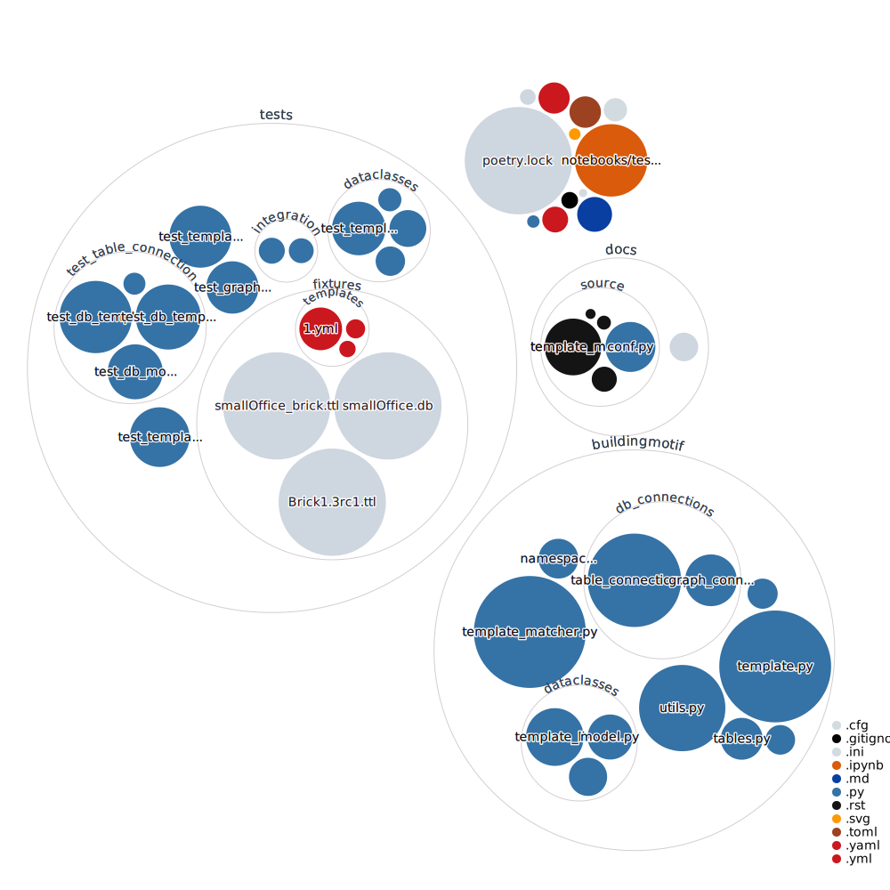

# BuildingMOTIF [](https://buildingmotif.readthedocs.io/en/latest/?badge=latest) [](https://codecov.io/gh/NREL/BuildingMOTIF) 

The Building Metadata OnTology Interoperability Framework (BuildingMOTIF)...

# Installing

Requirements:
- Python >= 3.9.0
- [Poetry](https://python-poetry.org/docs/)

Simply clone and run `poetry install`. Then run `poetry run pre-commit install` to set up pre-commit.

# Developing
To test, run 
``` 
poetry run pytest
```

To format and lint, run
```
poetry run black .
poetry run isort .
poetry run pylama
```

Documentation can be built locally with the following command, which will make the HTML files in the `docs/build/html` directory.

```
cd docs
poetry run make html
```

# Visualizing


