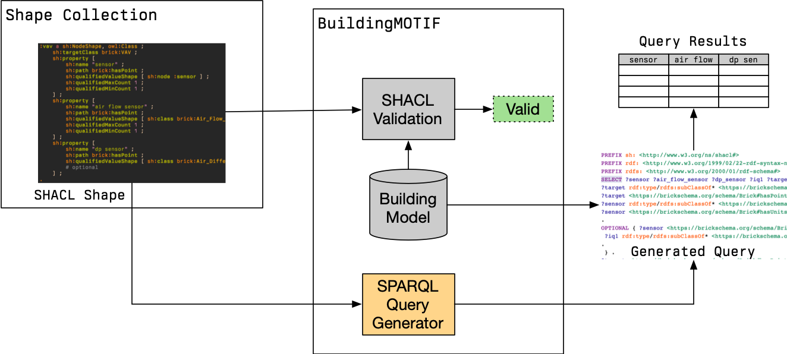

---
jupytext:
  cell_metadata_filter: -all
  formats: md:myst
  text_representation:
    extension: .md
    format_name: myst
kernelspec:
  display_name: Python 3
  language: python
  name: python3
---

# Generating SPARQL Queries

BuildingMOTIF contains support for generating SPARQL queries from SHACL shapes.
Recall that SHACL shapes ensure that a given model contains sufficient metadata to support a given application or suite of applications.
Generating a SPARQL query for a shape allows these applications to *retrieve* the metadata used to validate the graph, which is likely the same metadata the applications need for their own configuration and operation.



The figure above illustrates how the SHACL shape can be used to both validate a model as well as retreive information from it.
The variables of the SPARQL query (i.e. the "columns" of the result) are derived from the PropertyShapes included in the SHACL shape.

## Generating a Query

### Setup

Before we can generate a query, we need a `ShapeCollection` with at least 1 shape in it.
We can create a simple `ShapeCollection` as follows:

```{code-cell}
from rdflib import Graph, URIRef
from buildingmotif import BuildingMOTIF
from buildingmotif.dataclasses import ShapeCollection
from buildingmotif.namespaces import BRICK # import this to make writing URIs easier

# in-memory instance
bm = BuildingMOTIF("sqlite://")

sc = ShapeCollection.create()
sc.graph.parse(data="""
@prefix sh: <http://www.w3.org/ns/shacl#> .
@prefix brick: <https://brickschema.org/schema/Brick#> .
@prefix rdf: <http://www.w3.org/1999/02/22-rdf-syntax-ns#> .
@prefix rdfs: <http://www.w3.org/2000/01/rdf-schema#> .
@prefix owl: <http://www.w3.org/2002/07/owl#> .
@prefix bmotif: <https://nrel.gov/BuildingMOTIF#> .
@prefix : <urn:simpleapp/> .

: a owl:Ontology .

:app1 a sh:NodeShape ;
    sh:targetClass brick:Fan_Coil_Unit ;
    sh:property [
        sh:path brick:hasPoint ;
        sh:qualifiedMinCount 1 ;
        sh:qualifiedValueShape [ sh:class brick:Occupied_Cooling_Temperature_Setpoint ] ;
        sh:name "coolsp" ;
    ] ;
    sh:property [
        sh:path brick:hasPoint ;
        sh:qualifiedMinCount 1 ;
        sh:qualifiedValueShape [ sh:class brick:Occupied_Heating_Temperature_Setpoint ] ;
        sh:name "heatsp" ;
    ] ;
    sh:property [
        sh:path ( brick:feeds brick:hasPart brick:hasPoint ) ;
        sh:qualifiedMinCount 1 ;
        sh:qualifiedValueShape [ sh:class brick:Air_Temperature_Sensor ] ;
        sh:name "roomTemp" ;
    ] ;
.
""")
```

### Finding Shapes

We can ask the `ShapeCollection` for what shapes it contains which target certain classes.

```{code-cell}
for shape_name in sc.get_shapes_about_class(BRICK.Fan_Coil_Unit):
    print(shape_name)
```

We can also query the `ShapeCollection`'s graph directly:

```{code-cell}
shape_query = """
PREFIX sh: <http://www.w3.org/ns/shacl#>
SELECT ?shape WHERE { ?shape a sh:NodeShape }
"""
for (name,) in sc.graph.query(shape_query):
    print(f"{name} is a NodeShape")
```

### Generating Queries from Shapes

To generate a query, we call the `shape_to_query` function with the URI of a shape as the argument.

```{code-cell}
# refer to the shape by its URI
app1_shape = URIRef("urn:simpleapp/app1")

print(sc.shape_to_query(app1_shape))
```

The resulting string can be used to query a `Model` instance, e.g. using code like

```python
app_query = sc.shape_to_query(app1_shape)
for row in model.graph.query(app_query):
    print(row)
```

Below, we load a model from a file and use the generated query from above to
create a pandas `DataFrame` object with the query results.

```{code-cell}
from buildingmotif.dataclasses import Model
from rdflib import Namespace
import pandas as pd

# generate and save the query string to a variable
app_query = sc.shape_to_query(app1_shape)

# Create the 'building1' model and load the contents from a file
BLDG = Namespace("urn:building1")
model = Model.create(BLDG)
model.graph.parse("query_generation_example.ttl")

res = model.graph.query(app_query)
df = pd.DataFrame(res.bindings)
print(df.iloc[0])
```
